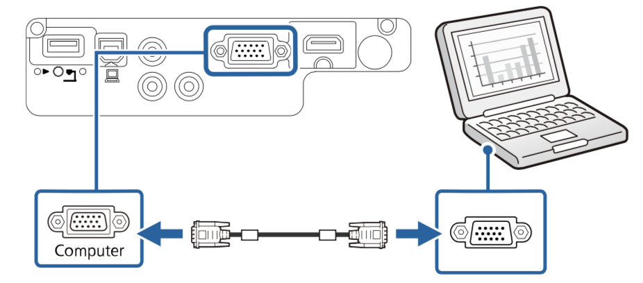
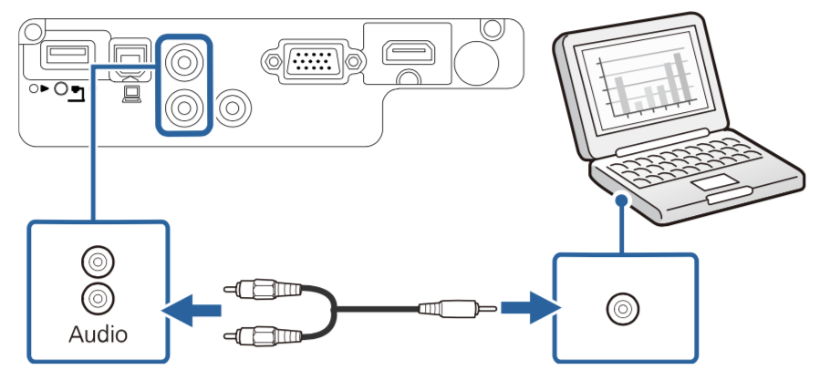
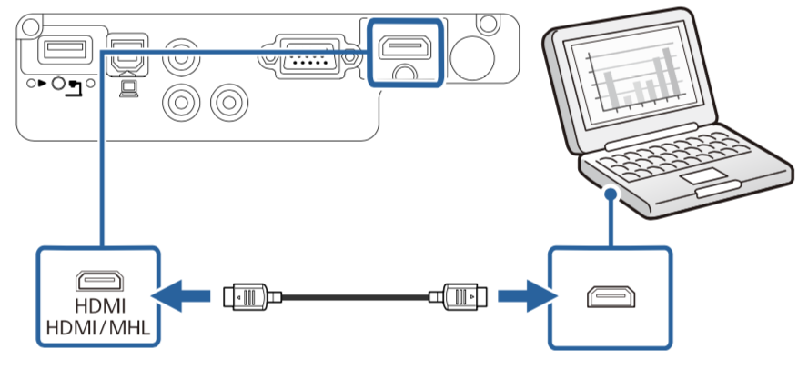

# 连接到 Mac

##### 使用 VGA 接头连接 Mac

- 将 VGA 计算机电缆连接到计算机的监视器端口。
- 将另一端连接到投影机上的 Computer 端口。

- 拧紧 VGA 连接器上的螺丝。
- 将音频电缆连接到Mac的耳麦或音频输出插孔。
- 将另一端连接到投影机的 Audio 端口。

##### 使用 HDMI 接头连接 Mac
- 将 HDMI 电缆连接到 Mac 的 HDMI 输出端口。
- 将另一端连接到投影机的 HDMI 端口。
- HDMI 同时支持视频和音频输出，不需要额外连接音频输出端口。
   

**注意**
- 新版的 Mac 可能需要用雷电/Type-C 转接线连接VGA/HDMI连接线，请根据需求进行选择。