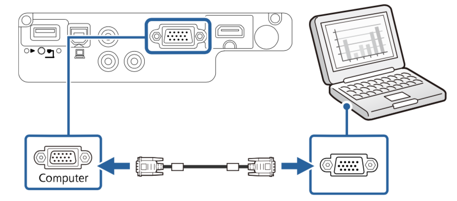
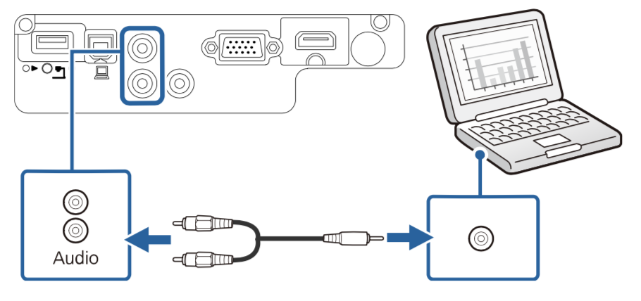

# 连接到Windows设备

##### 使用VGA计算机电缆将投影仪连接计算机

- **要连接不带 VGA 视频端口的计算机，需通过适配器连接到投影仪的 VGA 视频端口**
  
- 将 VGA 计算机电缆连接到计算机的监视器端口。
- 将另一端连接到投影机上的 Computer 端口，如图
 
- 拧紧 VGA 连接器上的螺丝。
- 将音频电缆的一端连接到笔记本电脑的耳麦或音频输出插孔。
- 将另一端连接到投影机的 Audio 端口，如图 
 

##### 使用HDMI电缆将投影仪连接到计算机

- **如果计算机配有 HDMI 端口，您可以使用 HDMI 电缆将其连接到投影机**
  
- 将 HDMI 电缆连接到计算机的 HDMI 输出端口。
- 将另一端连接到投影机的 HDMI 端口。
 