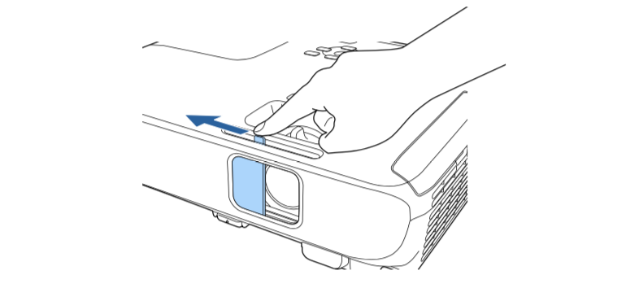
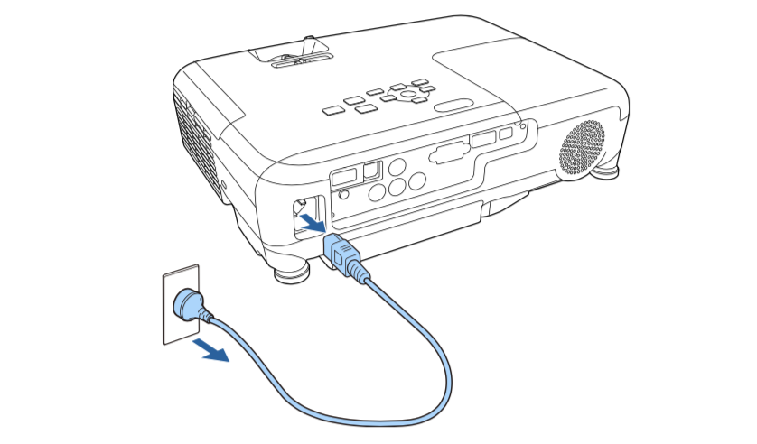
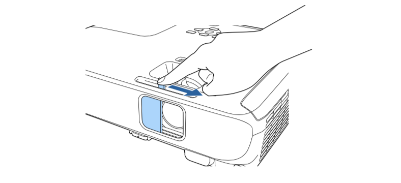

# 打开和关闭投影仪

### 打开投影仪

 1. 连接投影仪电源。将电源线连接到投影机的电源插口，然后将其插入到电源插座。
 
 
    投影机的电源指示灯会变为蓝色。它指示投影机已通电，但尚未打开(处于待机模式)。

 2. 按控制面板或遥控器上的电源按钮以打开投影机。
    投影机会发出嘟嘟声，投影机暖机时，状态指示灯会闪烁蓝色。一旦投影机暖机完毕，状态指示灯会停止闪烁并变为蓝色。

 3. 打开投影机的镜头盖。
 

 **如果看不到投影图像，请尝试以下操作。**
- 确认镜头盖已完全打开。
- 打开连接的计算机或视频设备。
- 使用便携式电脑时，从电脑中更改屏幕输出。
- 按控制面板或遥控器上的 [Source Search] 按钮以检查源
- 按遥控器上适合所需视频源的按钮。
- 如果主屏幕显示，请选择想要投影的源。
  
### 关闭投影仪

 1. 按控制面板或遥控器上的电源按钮。投影机显示关闭确认屏幕。
 

 2. 再按一下电源按钮。(要保持开启，请按任何其他按钮。)投影机会发出两次嘟嘟声，灯泡关闭，状态指示灯变熄灭。

 3. 要运输或存储投影机，请确保电源指示灯为蓝色 (但不闪烁)，然后拔下电源线插头。
 

 4. 关闭投影机的镜头盖。
 
